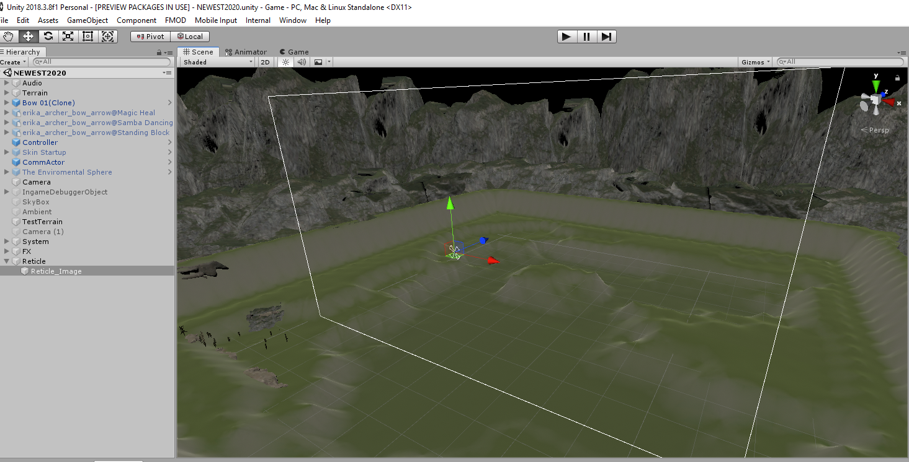
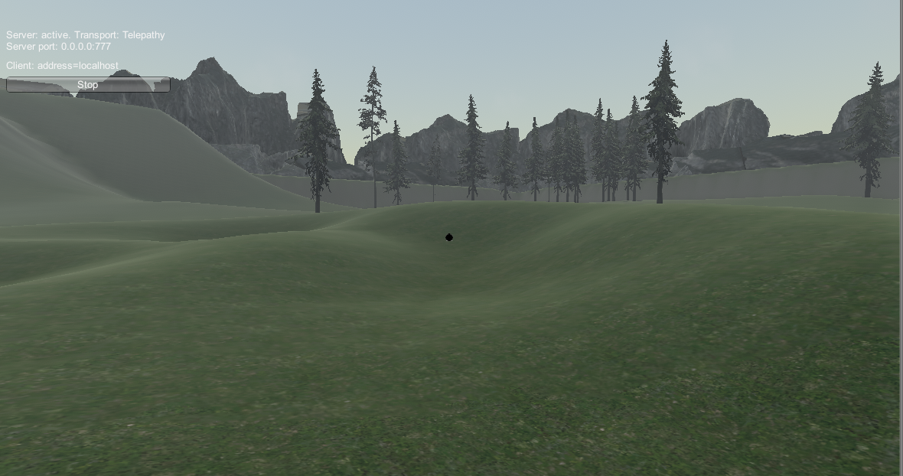

## <a href="index">Return to project 1 index</a>

### I Added a basic cross hair in to the game
### I followed this tutorial in order to get it working
### <a href="https://www.youtube.com/watch?v=y9TaleFxoVg">https://www.youtube.com/watch?v=y9TaleFxoVg</a>

## Image 01

### This is what I added in order to get the cross hair

## Image 02

### Here is what it looks like in game

### I added a Canvas and centered an image of a reticle image on it in order to create a cross hair in the center of the screen.