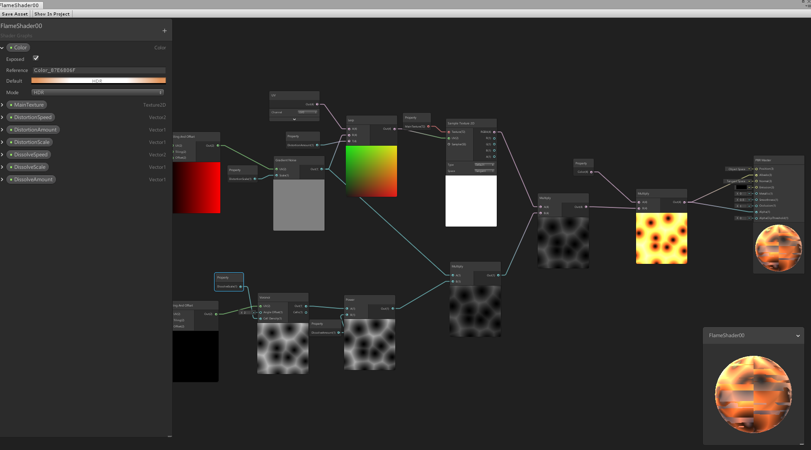

## <a href="project1">Return to project 1 index</a>

### I created a fire effect using a shader graph to visualise the effect of fire
### I followed this tutorial in order to get it working
### <a href="https://www.youtube.com/watch?v=glSsaRpHKos">https://www.youtube.com/watch?v=glSsaRpHKos</a>

## Image 01

### This is the shader graph node editor for the creating of the fire effect 

## Image 02

### This is the texture I used for the fire effect

## Image 03

### Here is what it looks like in game

## Solutions to errors

### There were some errors that I encountered when trying to use the shader graph

### Firstly the shader graph option for creating a shader graph was not available
### I followed a guide from this link to get it working  
### <a href="https://answers.unity.com/questions/1455530/shader-graph-option-missing.html">https://answers.unity.com/questions/1455530/shader-graph-option-missing.html</a>
### This issue was that shader graph was not installed and I needed to download a package to install it.

### When I was creating the fire shader graph I disovered that there was an error where the render pipeline was not compatible with the node
### So I followed this guide to get it to work
### <a href="https://answers.unity.com/questions/1535235/shader-graph-error-the-current-render-pipeline-is.html">https://answers.unity.com/questions/1535235/shader-graph-error-the-current-render-pipeline-is.html</a>
### The issue was that I needed to install the Lightweight Render Pipeline package and create a pipeline asset with this.