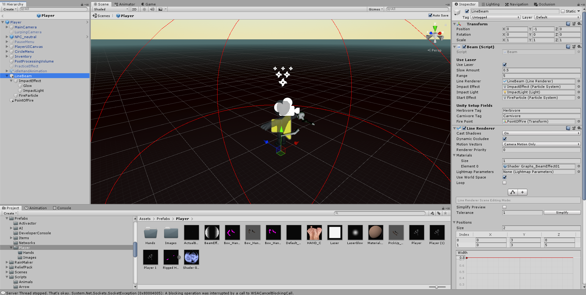
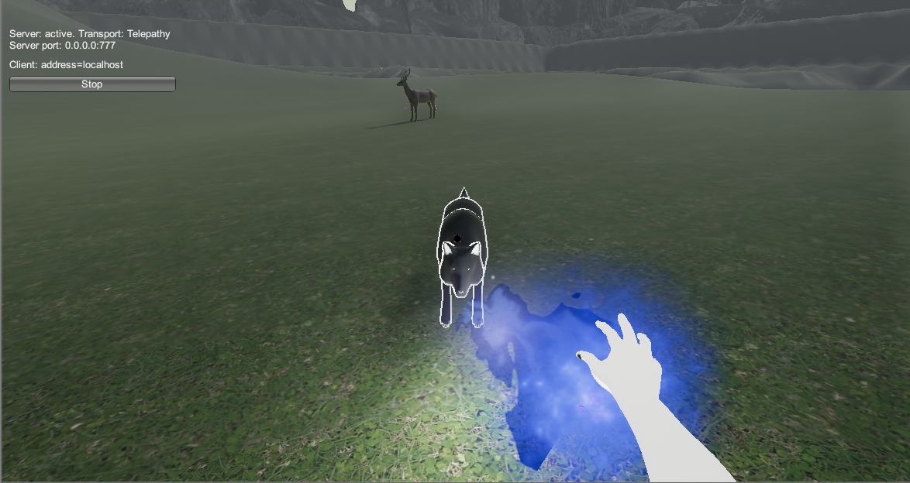
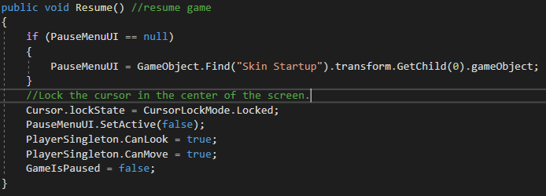
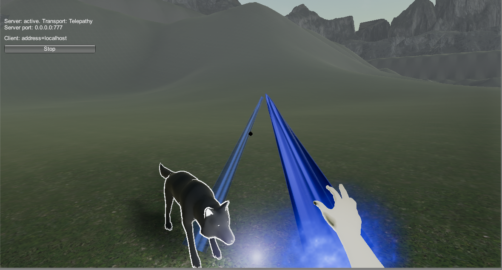

## <a href="project1">Return to project 1 index</a>

## Image 01

### I added the beam to the player asset
### This is so I could get the location of the player and could work out where the fire point would be placed.

## Image 02

### Here is what it looks like in game.

### I added this in when the player leaves the pause menu the cursor will be locked to the center of the screen. 

## Issues

### The quadratic curve on the beam did not properly work when I put in to the game.
### The bend point goes far off in to the distance.
### I was unable to fix this error so I removed it from the game.

