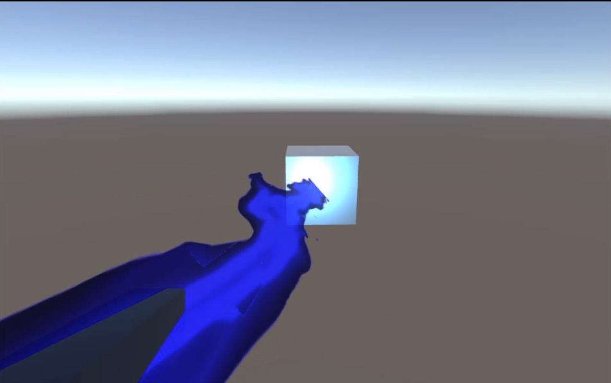
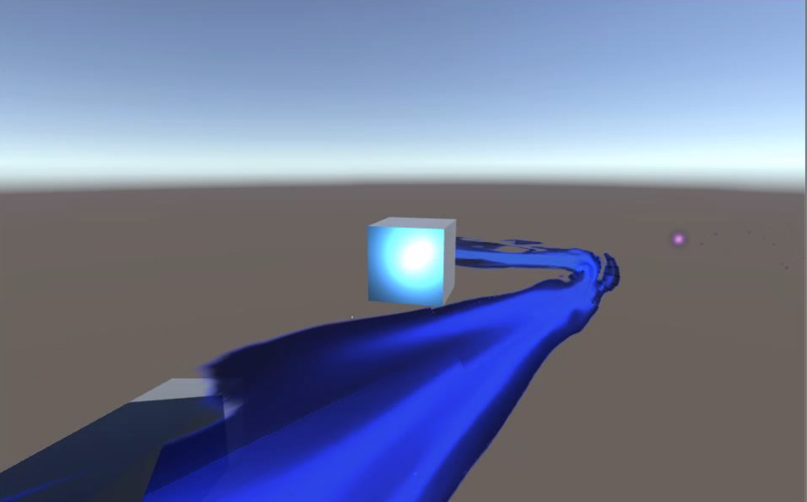
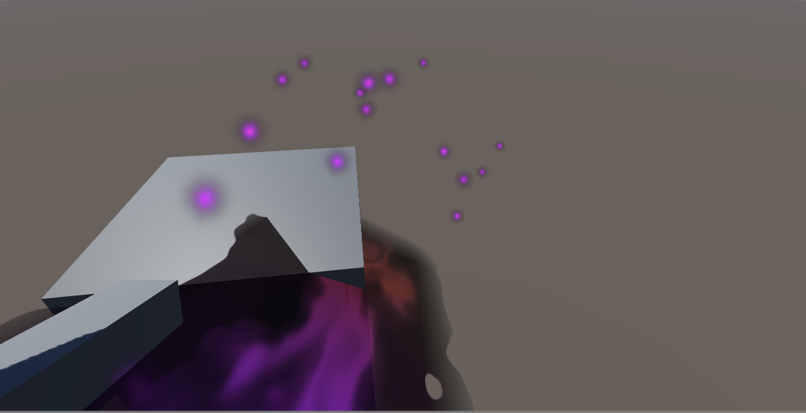

## <a href="project1">Return to project 1 index</a>

### I working on improving the basic functionallity of the beam
### I followed this tutorial and used it to improve the functionallity of the beam (line renderer)
### <a href="https://www.youtube.com/watch?v=5vw7RYxvqeE">https://www.youtube.com/watch?v=5vw7RYxvqeE</a>

### From this tutorial series I was able to improve the beam effect by
### Adding in a range detecter so that the beam would only be fired when it is in range of the target.
### The beam will also follow the target while it is in range.
### I also changed the beam so it would be disabled and thus not visible 

## Image 01

### The beam will follow the target when the target moves

## Image 02

### The beam will bend using the quadratic curve and be locked on to the target
### I added a glow effect where the target will create a light when it is hit by the beam.

### Issues that were fixed

## Image 03

### The beam would before not properly be locked on to the target and would clip through the target.
### This can be seen in the above images

