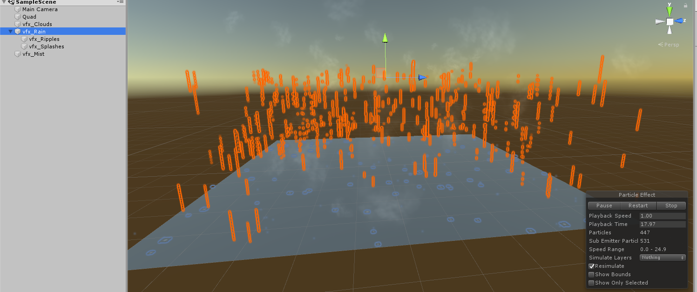
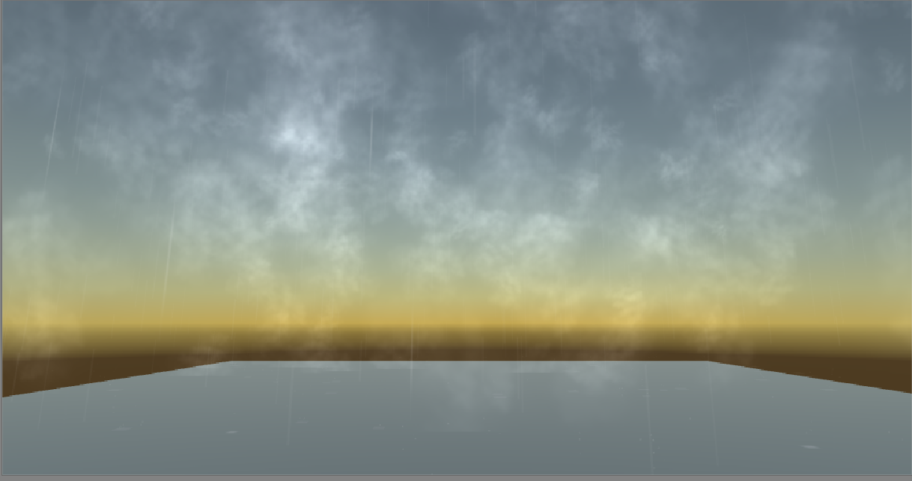

## <a href="index">Return to index</a>

### I created a rain effect to visualise the effect of rain falling
### I followed this tutorial in order to get it working
### <a href="https://www.youtube.com/watch?v=Ph3FvxJJ8AA">https://www.youtube.com/watch?v=Ph3FvxJJ8AA</a>

## Image 01

### This is the rain effect I created using particles.
### I created some particle effects to add clouds, mist and rain to make it look like rain is falling.

### This is what the rain effect looks like when the game is running
