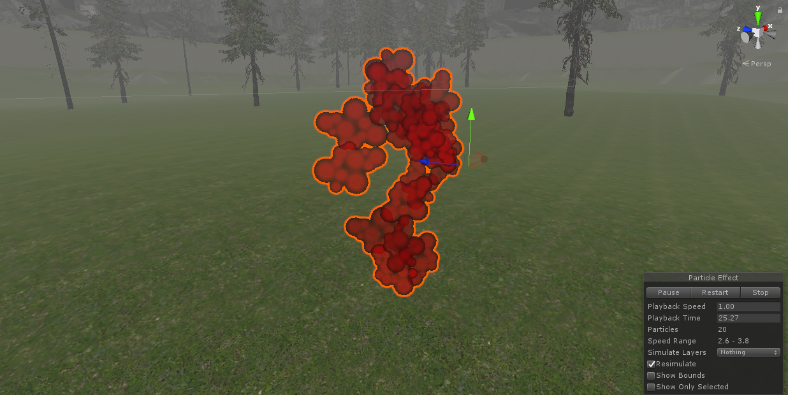

## <a href="project2">Return to project 2 index</a>

### I created a particle system to simulate the effect of blood.
### I followed this tutorial to create the blood particles.
### <a href="https://www.youtube.com/watch?v=zNC65seEadI">https://www.youtube.com/watch?v=zNC65seEadI</a>

## Image 1

### Here is how it tirned out using overcloud
### There are textures that do not properly work when using overcloud

## Solutions to errors

### This effect did not work as intended.
### I could not find a way to detect when an arrow collides with a deer or a wolf.
### Because I this I was not able to get this effect to work.

