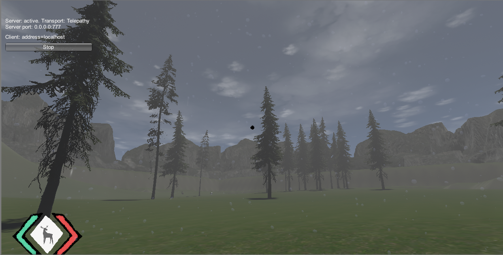

## <a href="project2">Return to project 2 index</a>

### I created a particle system to simulate the effect of rain falling on the camera.
### I followed this tutorial to create the rain effect.
### <a href="https://www.youtube.com/watch?v=A4K5nYhNAEs">https://www.youtube.com/watch?v=A4K5nYhNAEs</a>

## Image 1

### Here is how the effect looks like in game

## Solutions to errors

### Because this effect it located in the player prefab in the canvas it is disabled when the player pauses the game.
### Thus the rain on camera is not visible when the game is paused.