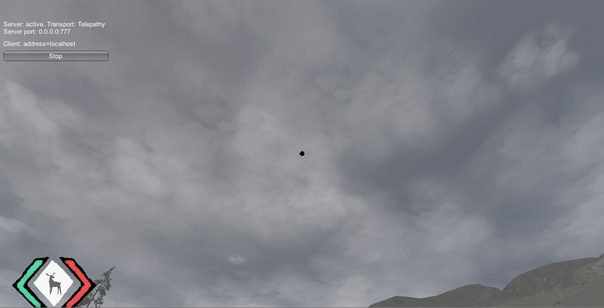

## <a href="project2">Return to project 2 index</a>

### Since there was already clouds in the game, I edited these and improved them.
### I also made the clouds increase when it started raining or snowing.

## Image 01

### Default size of the clouds.

## Image 02

### Here is how the clouds look like when it is raining or snowing.

## Image 03

### Code for increasing the size of the clouds

## Solutions to errors

### There was an issue with the clouds were they would spin around when the player moves.
### I solved this by setting the clouds to stick to the view for the world instead of the player.