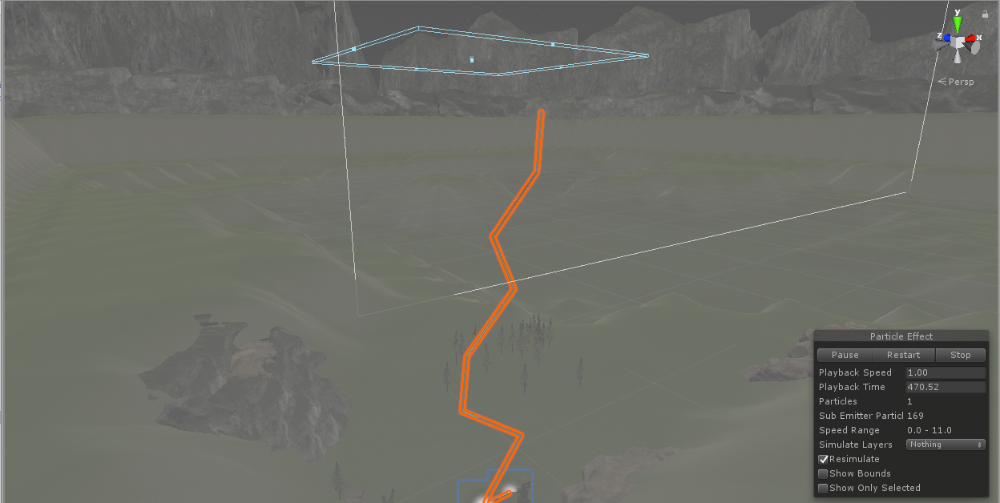
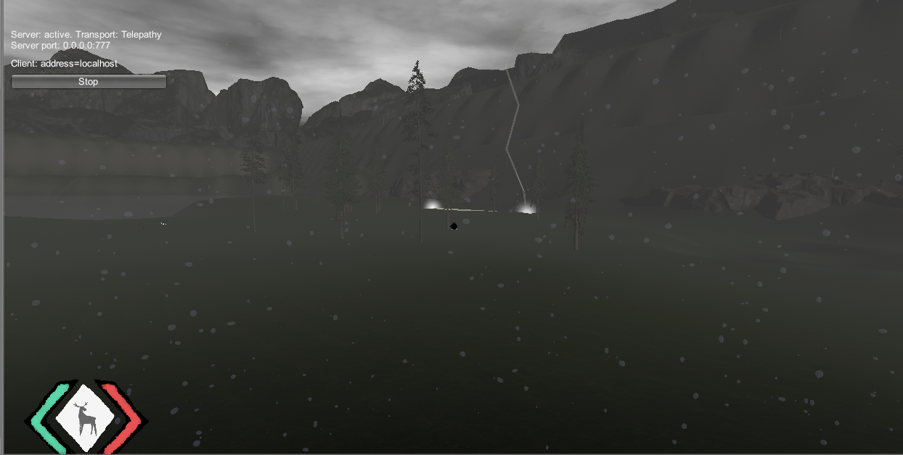
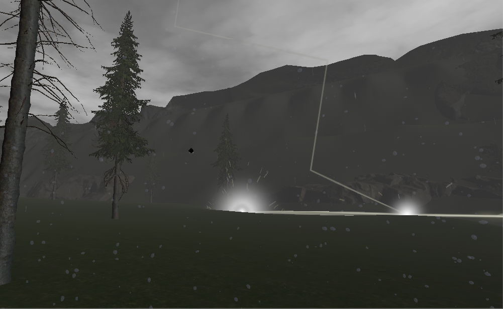
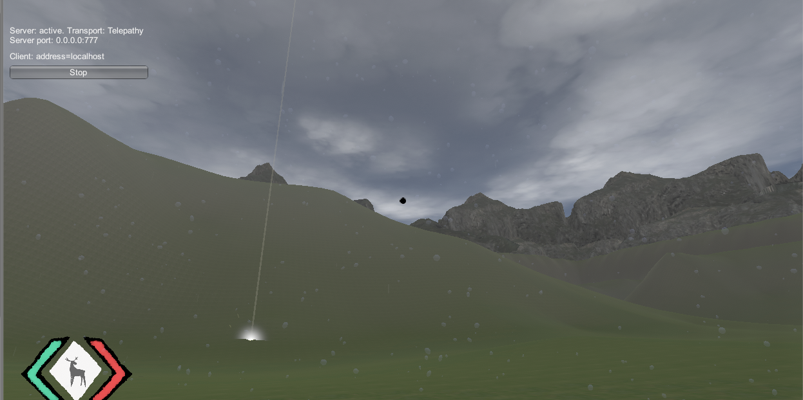

## <a href="project2">Return to project 2 index</a>

### I created a particle system to simulate the effect of lightning.
### I followed this tutorial to create the lightning particles.
### <a href="https://www.youtube.com/watch?v=ewC_c6aHbf8">https://www.youtube.com/watch?v=ewC_c6aHbf8</a>

## Image 01

### Here is what the lightning particle looks like.

## Image 02

### This is the in game lightning effect.
### The lightning has an effect when it hit the ground seen in the image.

## Solutions to errors

### The position of the lightning was too low.
### When the ligtning appears it would appear in the air instead of from above.
### Solution: I increased the height of the lightning so it spawns above the map and falls down.

### Adding a noise effect to the lightning makes it zig-zagged and looks like lightning.
### however sometimes the lightning hits the ground and bounces around created a strange effect.

### Turning off the noise filter results in the lightning being a simple straight line and losing its effect.

