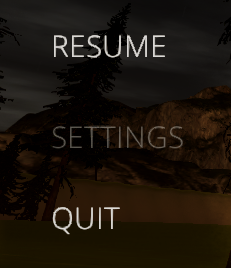
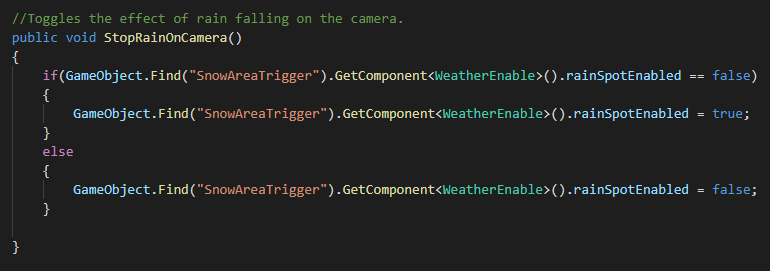

### Greying out options in the menu that are not fully implemented yet

## Image

### Here is what the button looks like when it is greyed out.

## Hidden Extra Feature

### I added an extra feature where you can toggle the rain falling on the camera.

### By clicking on the settings button in the menu you can toggle whether the rain falling on the camera is visable or not.

### I added this because sometimes the effect gets in the way and is distracting

### This could be an extra feature to add to the setting menu when it is fully implemented.