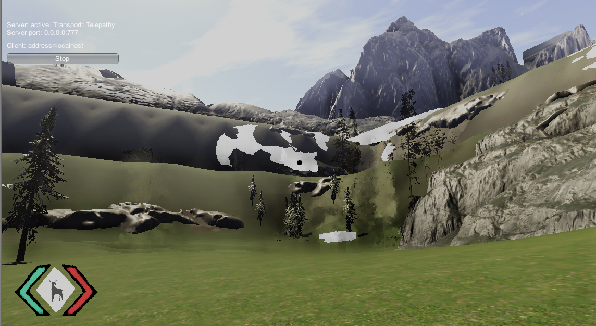

### Testing Skin with Overcloud

### This did not end up working as it is incompatible with the hdrp used in Skin

## Image

### Here is how it tirned out using overcloud
### There are textures that do not properly work when using overcloud

### Here is another image from overcloud where there are strange transparent trees appearing.
