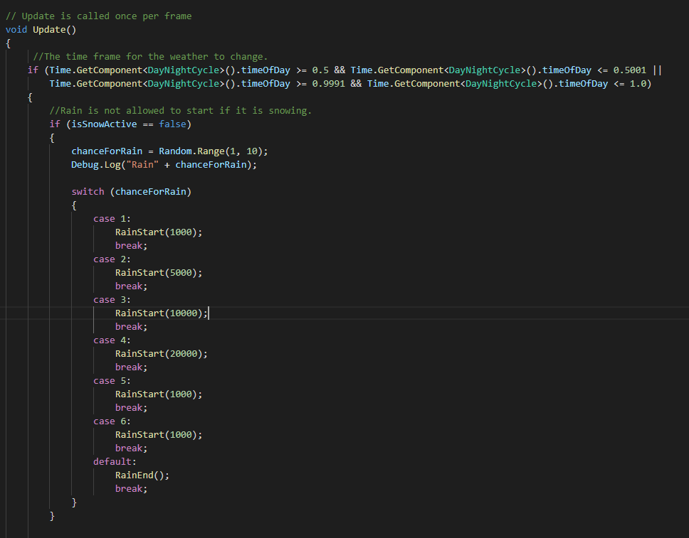
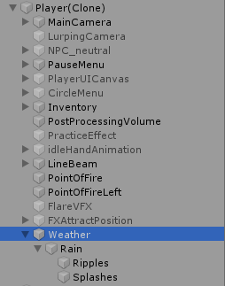
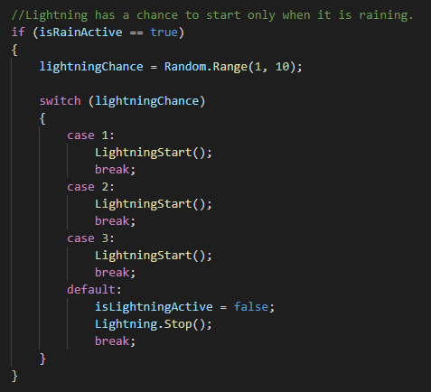
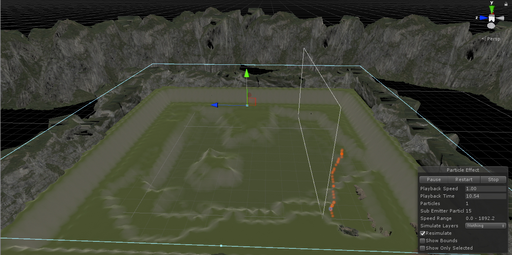
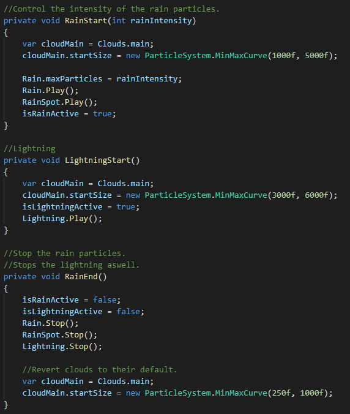

## <a href="project2">Return to project 2 index</a>

### Fixing up old features that had issues and reworking them to perform better.

## Rain

## Image 01

### Here is what the new rain script looks like.
### The rain will now be determined by the time of day.
### There are two times whens this occurs at points of the day 0.5 and 1.0.
### It now allows the rain to be started, stopped and intensity based on the random number generated.
### I created a function for this so I did not have to repeat starting and stopping the rain for every case in  the switch statement.
### Rain is now allowed o start when it is snowing.

## Image 02

### I moved the rain to the player prefab so the rain will occur only around the player solving an issue I previously had where the rain only occured in one area.
### By doing this the player will see rain falling around them anywhere on the map providing the rain is falling.

## Lightning

## Image 03

### I created a script for the lightning
### The lightning is only allowed to start after the rain has started.

## Image 04

### The lightning effect now has an increased range so it can fall anywhere on the map instead of in only one spot.
### The lightning is the only weather effect that can do this while having no effect on the game performance because the is only ever one lightning particle at a time. 

## Start & Stop script

## Image 05

### This is the script used to start and stop the rain and lightning.

### First the clouds size is increased.
### The intensity of the rain particles are set.
### Then the particles are started.
### The weather effect is set to true.

### Lightning is stopped at the same time as rain.
### The clouds are returned to their original size.