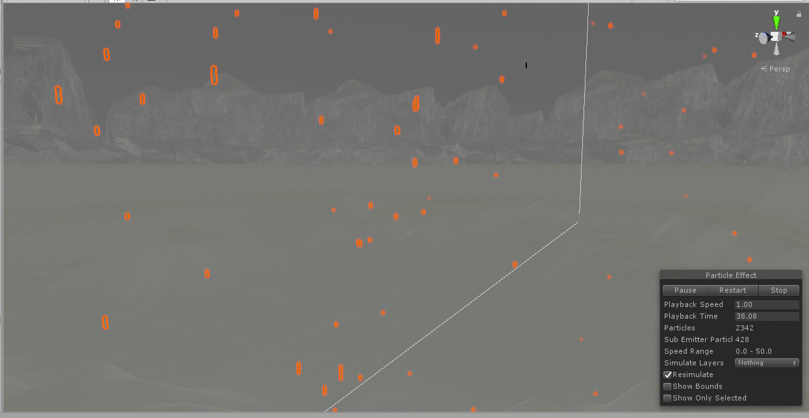
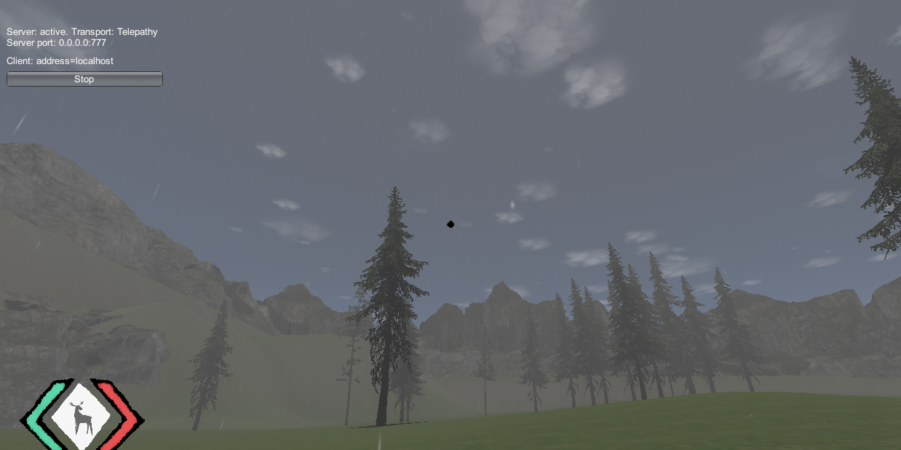
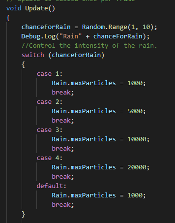

## <a href="project2">Return to project 2 index</a>

### I created a particle system to simulate the effect of rain falling.
### I followed this tutorial to create the rain particles.
### <a href="https://www.youtube.com/watch?v=Ph3FvxJJ8AA">https://www.youtube.com/watch?v=Ph3FvxJJ8AA</a>

## Image 01

### Rain Particles.

## Image 02

### Here is how the rain looks in game.

## Image 03

### Code for determining the intensity of the rain.

## Solutions to errors

### The rain has the same issue as the snow in that it only falls in a certain area which is around the spawn area.

### This issue is solved later in the 'Polish' section.