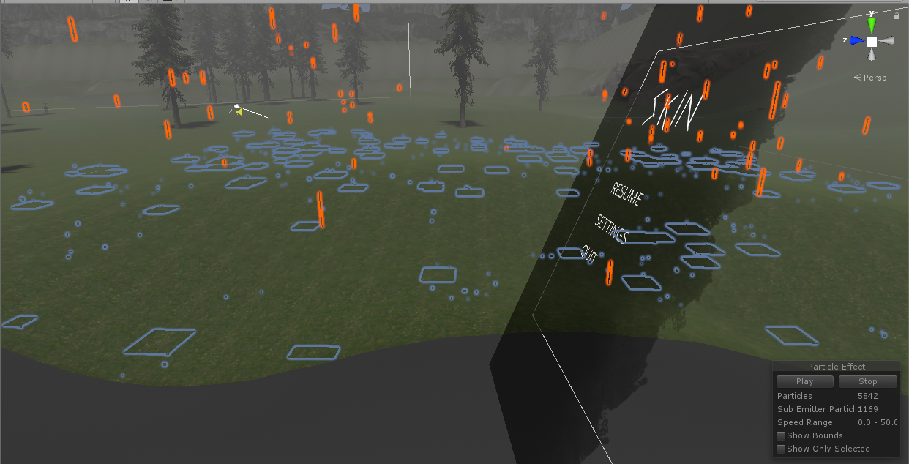

## <a href="project2">Return to project 2 index</a>

### I created a particle system to add an effect to the rain particles when they collide with the ground.
### I followed this tutorial to create this rain effect.
### <a href="https://www.youtube.com/watch?v=Ph3FvxJJ8AA">https://www.youtube.com/watch?v=Ph3FvxJJ8AA</a>

## Image 01

### Here is what the effect looks like.
### This creates a splash effect when the rain particle hits the ground.
