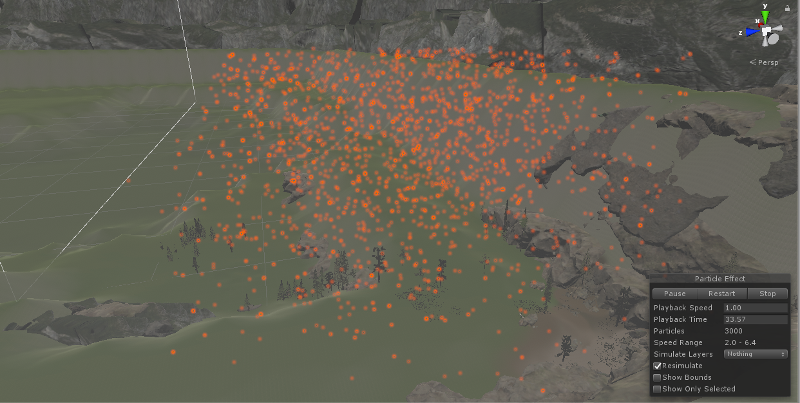
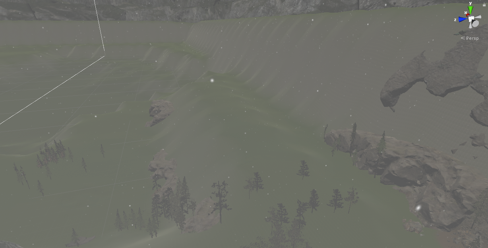
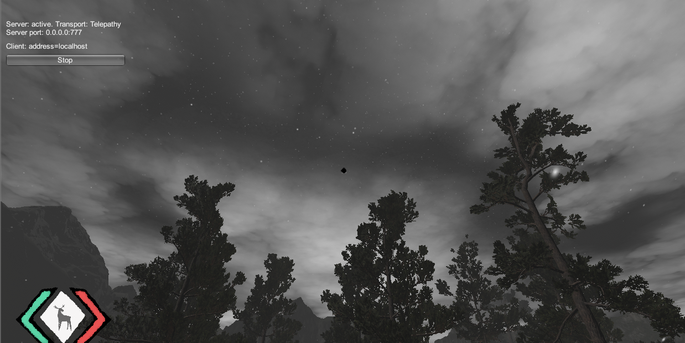
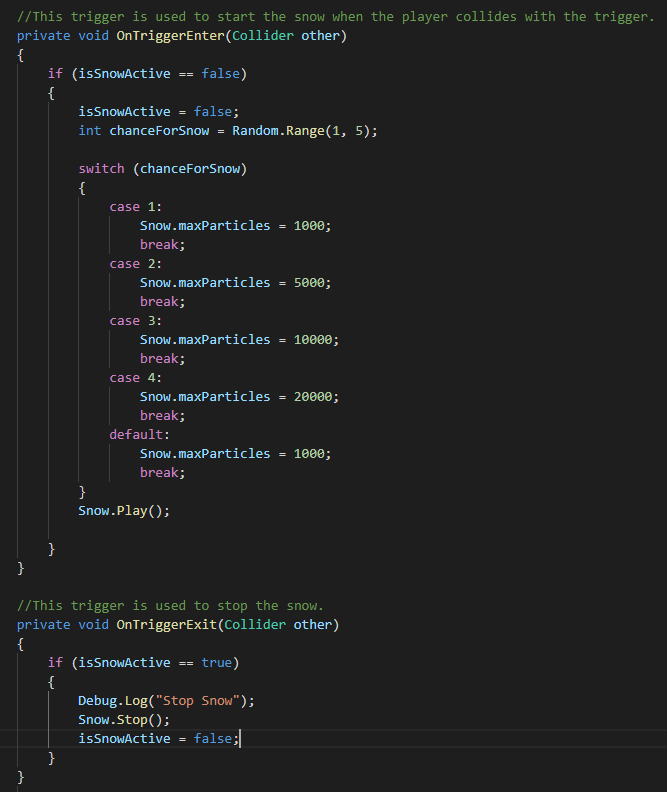
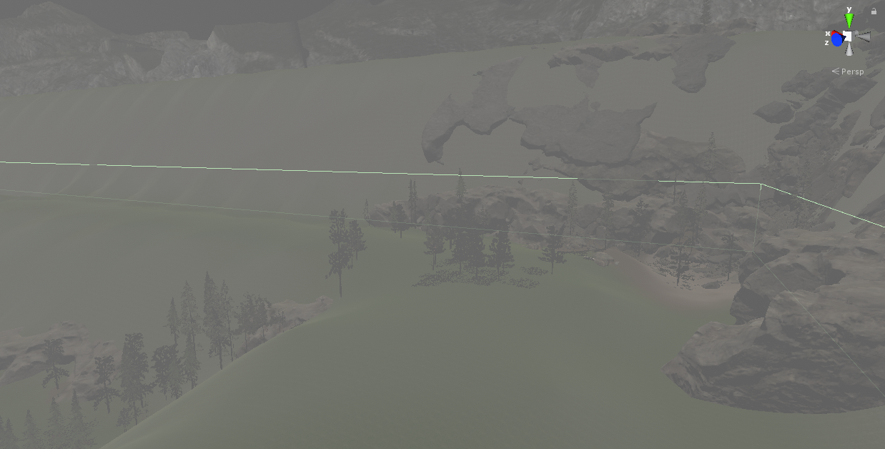

## <a href="project2">Return to project 2 index</a>

### I created a particle system to simulate the effect of snow falling.
### I followed this tutorial to create the snow particles.
### <a href="https://www.youtube.com/watch?v=b8oVAS9IdZM">https://www.youtube.com/watch?v=b8oVAS9IdZM</a>

## Image 01

### Here is the area where the snow particles fall.

## Image 02

### Here is what the snow particles look like.

## Image 03

### This image shows how the snow effect looks like in game.

## Image 04

### Here is the script I used to start and stop the snow.
### The snow is started when the player enters the trigger area,
### And is stopped when the player leaves the trigger.

## Solutions to errors

### Finding a way to start & stop the snow

### I used a trigger that is set off when they player walks into it.
### This trigger is located at the top of the hill at a high elevation.

### I found this article to help create the trigger event.
### <a href="https://docs.unity3d.com/ScriptReference/Collision-gameObject.html">https://docs.unity3d.com/ScriptReference/Collision-gameObject.html</a>

### The snow particles are only located on one corner of the map.
### Increasing the range of the particles would result in:
### there being fewer snow particles falling around the player
### And increasing the amount of particles to account for this would have a huge negative effect on the games performance.
