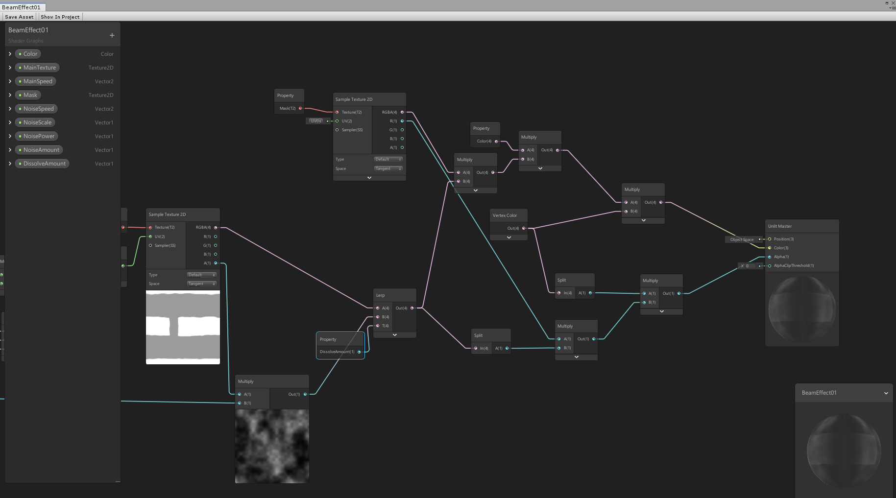

## <a href="index">Return to index</a>

### I created a beam effect using a line renderer and a shader graph material
### I followed this tutorial in order to get it working
### <a href="https://www.youtube.com/watch?v=mGd3nYXj1Oc">https://www.youtube.com/watch?v=mGd3nYXj1Oc</a>

## Image 01

### This is the shader graph node I set up for the beam.

## Image 02

### This is the texture I used for the beam.

## Image 03

### This is how the beam look in game.
