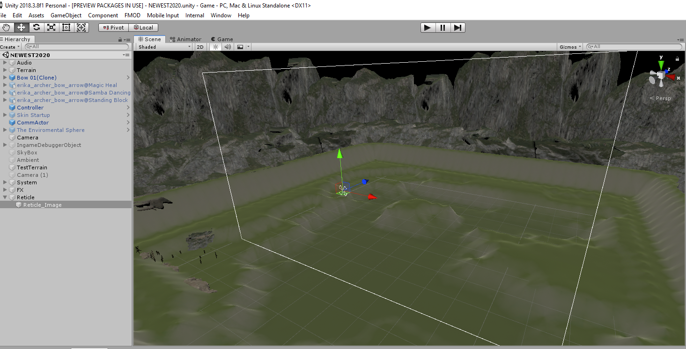
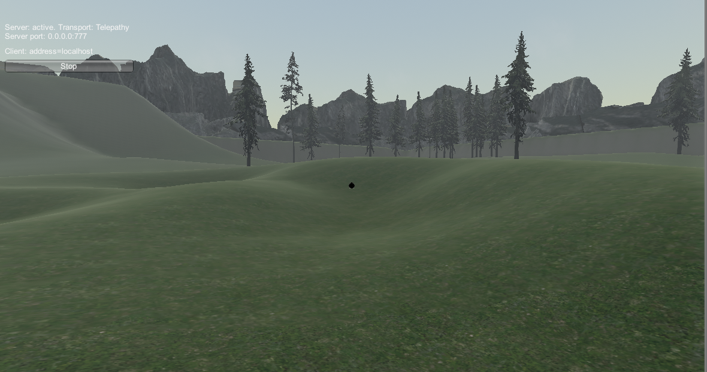

## <a href="index">Return to index</a>

### I created a fire effect using a shader graph to visualise the effect of fire
### I followed this tutorial in order to get it working
### link

## Image 01

### This is the shader graph 

## Image 02

### Here is what it looks like in game
