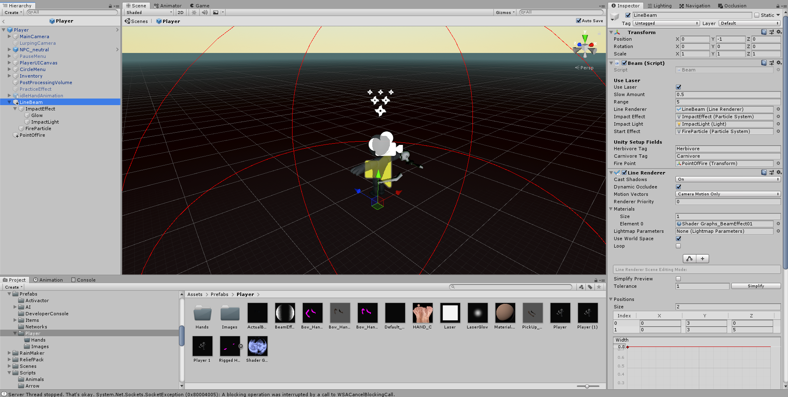
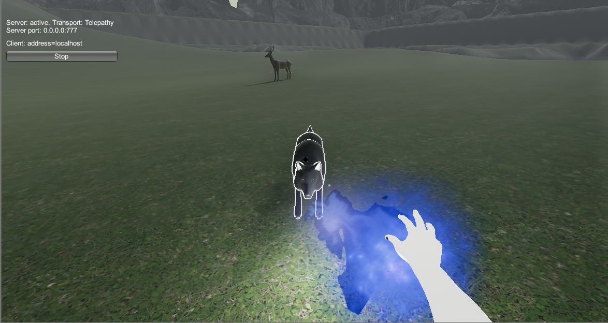
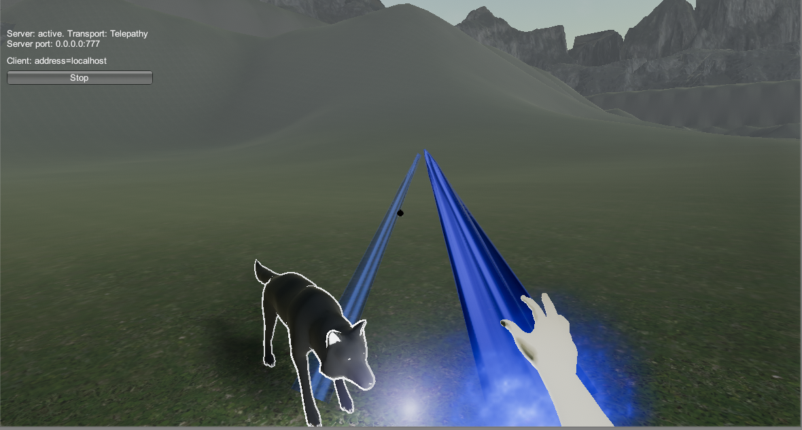

## <a href="index">Return to index</a>

### I Added a basic cross hair in to the game
### I followed this tutorial in order to get it working
### link

## Image 01

### I added the beam to the player asset 

## Image 02

### Here is what it looks like in game

## Issues

### The quadratic curve on the beam dis not properly work when I put in to the game

