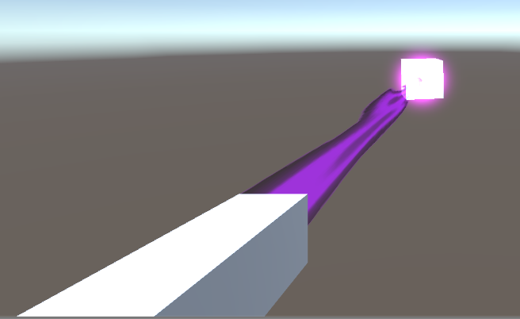
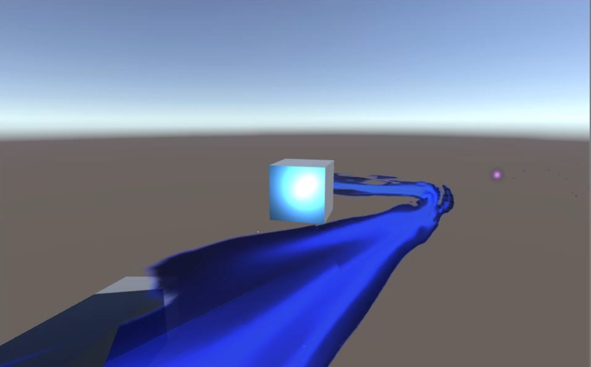

## <a href="index">Return to index</a>

### I working on improving the basic functionallity of the beam
### I followed this tutorial and used it to improve the functionallity of the beam (line renderer)
### <a href="https://www.youtube.com/watch?v=5vw7RYxvqeE">https://www.youtube.com/watch?v=5vw7RYxvqeE</a>

### From this tutorial series I was able to improve the beam effect by
### Adding in a range detecter so that the beam would only be fired when it is in range of the target.
### The beam will also follow the target while it is in range.
### I also changed the beam so it would be disabled and thus not visible 

## Image 01

### 

## Image 02

### Here is what it looks like in game

