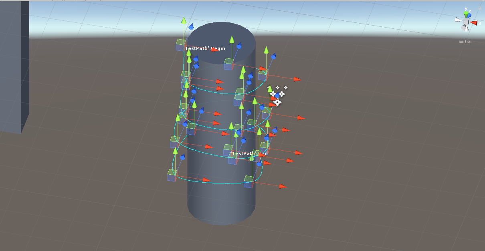
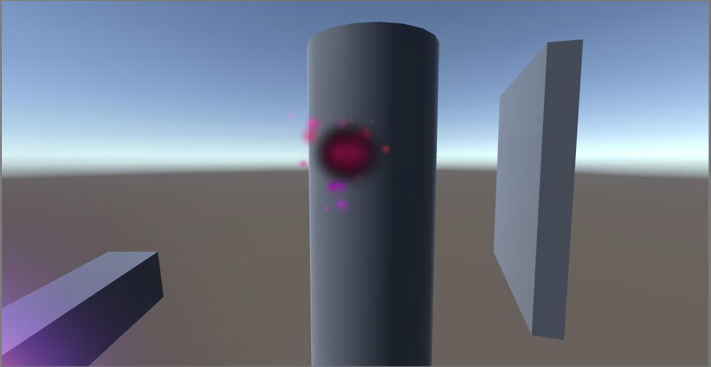

## <a href="index">Return to index</a>

### I created a particle that follows a path
### I followed this tutorial in order to get it working
### <a href="https://www.youtube.com/watch?v=tZ5dSmsggFc&list=PLpPd_BKEUoYh40LeJXTgA6E53gCMPq3MX&index=16">https://www.youtube.com/watch?v=tZ5dSmsggFc&list=PLpPd_BKEUoYh40LeJXTgA6E53gCMPq3MX&index=16</a>

## Image 01

### I created a path that will go around a cylinder
### This is what the path looks like in unity.

## Image 02

### I made a particle that will follow this path
