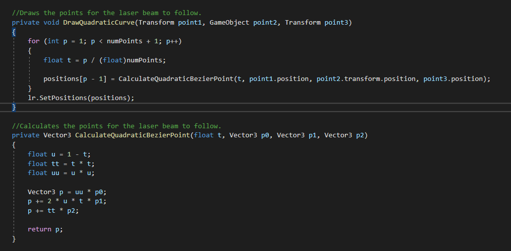
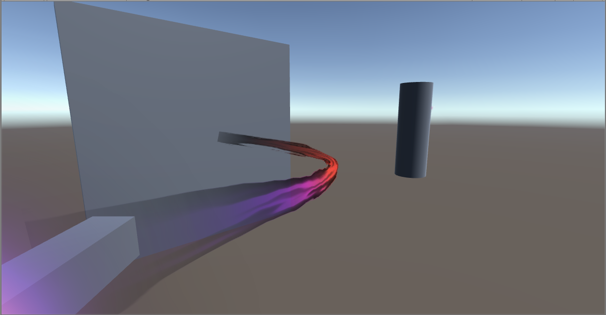
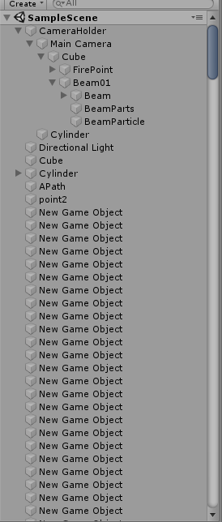
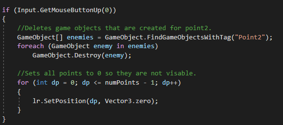

## <a href="index">Return to index</a>

### I added a quadratic curve that the beam fill follow
### I followed this tutorial in order to get it working
### <a href="https://www.youtube.com/watch?v=RF04Fi9OCPc">https://www.youtube.com/watch?v=RF04Fi9OCPc</a>

## Image 01

### I added these functions to calculate and draw the beam on a quadratic curve  

## Image 02

### This is what the curved line looks like in game

## Solutions to errors

## Image 03

### There was an issue that I had where a game object for point 2 (center point) that would multiply every time it was called.
### This would lead to the game taking up excess resources

### I looked at these links and found a solution to try
### I gave all of the extra game objects a unique tag so I could easily locate them.
### I added some code that would find all the objects with that unique tag and remove them all when the mouse button is released.
### The points on the points are all set to go to position 0 which would hide them making them invisible. 
### <a href="https://forum.unity.com/threads/solved-how-to-set-a-gameobject-tag-through-a-script.56581/">https://forum.unity.com/threads/solved-how-to-set-a-gameobject-tag-through-a-script.56581/</a>
### <a href="https://answers.unity.com/questions/1143629/destroy-multiple-gameobjects-with-tag-c.html">https://answers.unity.com/questions/1143629/destroy-multiple-gameobjects-with-tag-c.html</a>

## Image 04

### This is where I removed the extra points and made the beam invisible.

## Image 05

### The beam would remain behind after the player releases the mouse button before adding the hide code above.

