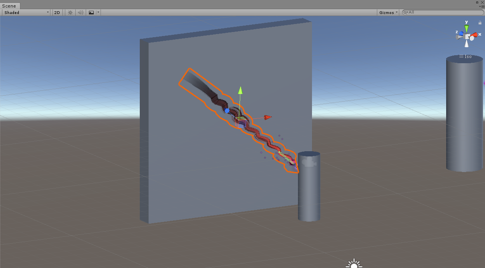

## <a href="index">Return to index</a>

### I created a sine wave for the beam to follow
### I followed this tutorial expanding from the quadratic curve in order to get it working
### <a href="https://www.youtube.com/watch?v=aAGkn0ETFX4">https://www.youtube.com/watch?v=aAGkn0ETFX4</a>

## Image 01

### This is what the sine wave looks like when the beam is used.
### The sine wave did not work properly with the beam so I did not end up using it.

